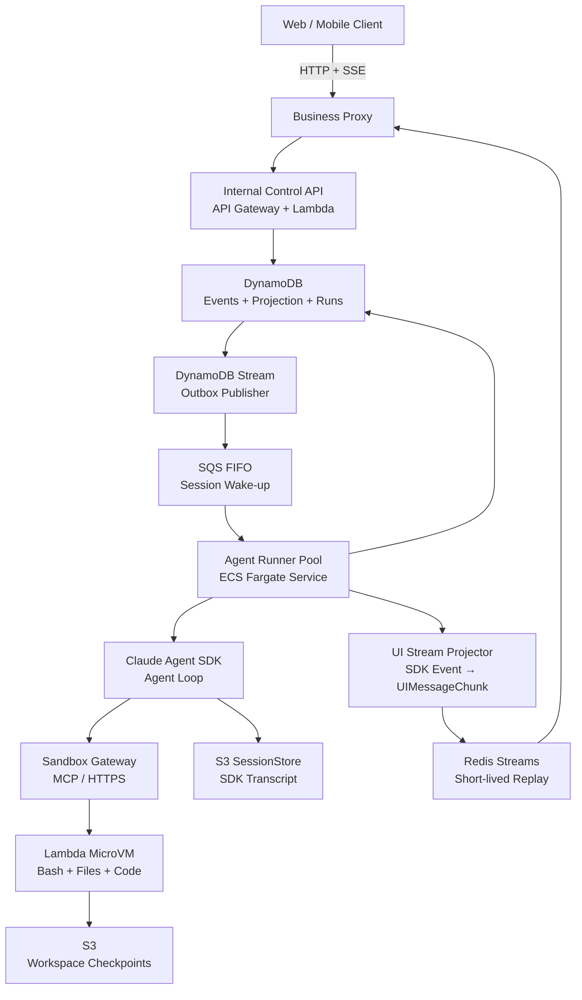
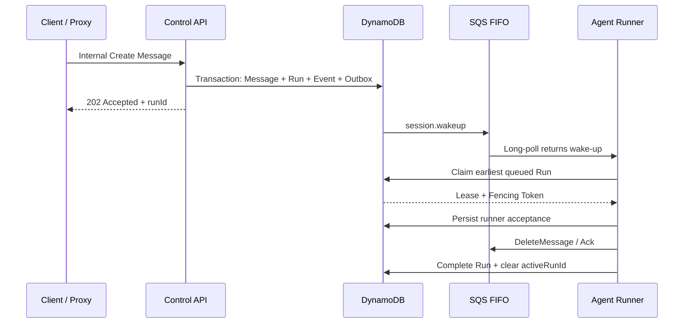
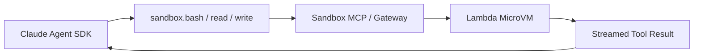
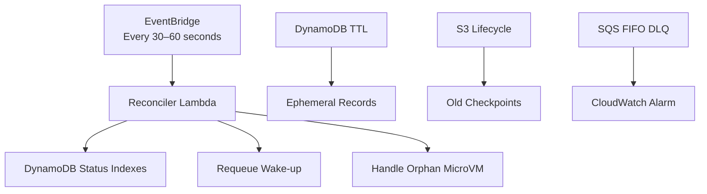
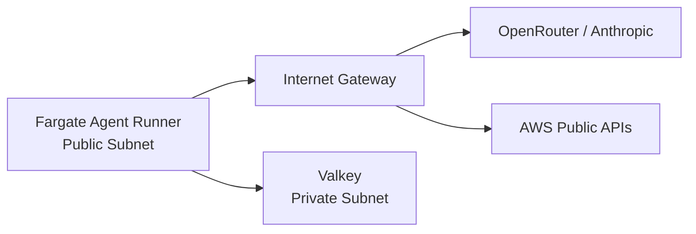

# Claude Agent SDK 自建托管架构设计

> TypeScript · DynamoDB · SQS FIFO · ECS Fargate · Lambda MicroVM  
> 版本：v1.5  
> 日期：2026-09-03  
> 状态：架构设计稿，不包含实现代码

## 1. 执行摘要

本设计的目标是：使用 TypeScript 和 Claude Agent SDK，在 AWS 上构建一个接近 Claude Managed Agents 思路的轻量、持久、可恢复的 Agent 平台。

核心原则：

- **DynamoDB 保存 Agent 的持久事实与当前状态。**
- **SQS FIFO 只负责发送 `session.wakeup`，不保存 Agent 历史，也不决定具体执行哪个 Run。**
- **ECS Fargate Agent Runner 运行 Claude Agent SDK 和 Agent loop。**
- **Lambda MicroVM 只负责 Bash、文件、依赖安装、代码运行等不可信执行。**
- **S3 SessionStore 持久化 Claude Agent SDK transcript；S3 Workspace Checkpoint 保存 MicroVM 文件状态。**
- **Web 端使用 AI SDK `useChat` 和自定义 `ChatTransport`；Agent Service 输出 UI Message Stream Protocol。**
- **Claude Agent SDK `SDKMessage`、平台 Session Event、内部 Orchestration Event 和 AI SDK `UIMessage` 是四个边界清晰的数据层，不直接互相替代。**
- **Redis Streams 短期保存 `UIMessageChunk`，支持 SSE 断线后按 cursor 回放；V1 cursor 存在浏览器 `sessionStorage`。**
- **Agent Runner 部署在 Public Subnet，并分配 Public IPv4；它只主动发起出站连接，Security Group 不开放入站，因此 V1 默认不使用 NAT Gateway。**
- **同一 Session 默认同时只能存在一个 Active Run；不同 Session 可以并行。**
- **系统按照 at-least-once delivery 设计，通过幂等、条件写、Lease 和 Fencing Token 获得 effectively-once 状态转换。**
- **V1 不实现交互式 Approval；Sandbox 内低风险工具按 Policy 自动允许，所有需要人工确认的外部副作用默认拒绝。Approval 作为 V2 功能接入预留的 Permission/Tool Event 边界。**

一句话概括：

> DynamoDB 记住 Agent 的业务生命与 UI Message Projection，SQS 叫醒 Agent，Fargate Runner 承载 Agent 的大脑，S3 SessionStore 恢复 Claude Context，Lambda MicroVM 提供电脑，Redis Streams、Proxy 和 Custom ChatTransport 把可恢复的 UI Message Stream 送给 `useChat`。

## 2. 与 Claude Managed Agents 的关系

这个设计遵循 Claude Managed Agents 的主要架构思想，但不是对 Anthropic 产品内部实现的复制。

Claude Managed Agents 使用自托管 Sandbox 时，Agent 编排仍然位于 Anthropic 控制面，客户基础设施只执行工具。我们的自建版本将对应组件替换为：

| Claude Managed Agents 概念 | 自建版本 |
|---|---|
| Anthropic 持久控制面 | DynamoDB + SQS + Agent Runner |
| Managed Agent loop | Fargate 中的 Claude Agent SDK |
| Environment work queue | SQS FIFO |
| Self-hosted sandbox worker | Sandbox Gateway + Lambda MicroVM |
| Hosted session event log | DynamoDB event log |
| Agent session transcript | Claude Agent SDK SessionStore + S3 |
| Sandbox state | MicroVM + S3 checkpoint |

最重要的共同点是：

> **持久编排位于可替换的 Sandbox 外部。**

## 3. 总体架构



### 3.1 控制面

控制面负责：

- Session、Message、Run 和 Attempt 生命周期
- Claude Agent SDK 和模型调用
- Run 排队、互斥、Lease 与恢复
- 事件持久化和客户端实时流
- Tool permission policy、预算、取消和暂停；交互式 Approval 属于 V2
- MicroVM 的分配与生命周期协调

控制面包括：

- API Gateway / Control Lambda
- Business Proxy（用户 HTTP/SSE 连接终点）
- DynamoDB
- SQS FIFO
- ECS Fargate Agent Runner Service
- Claude Agent SDK
- UI Stream Projector
- Redis Streams 短期实时回放通道
- Reconciler Lambda

### 3.2 执行面

执行面负责：

- Bash 命令
- 文件读写
- 依赖安装
- 运行生成代码
- 子进程管理
- 经过授权的网络访问

执行面包括：

- Sandbox Gateway 或 Sandbox MCP Server
- Lambda MicroVM
- S3 Workspace Checkpoint

### 3.3 组件职责

| 组件 | 负责 | 明确不负责 |
|---|---|---|
| Business Proxy | 用户认证、产品逻辑、保持 SSE、从 Redis Stream 读取并转发 UI Message Protocol | 不运行 Agent loop，不决定 Run 调度 |
| Control API | 接收 Message、取消和暂停；事务写入数据；为 V2 Approval 预留确认入口 | 不直接运行 Agent |
| DynamoDB | 保存 Event、Projection、Run、Lease、幂等记录和 Checkpoint 指针 | 不负责启动计算 |
| SQS FIFO | 发送 Session Wake-up，缓冲突发流量 | 不保存 Agent 历史，不决定具体 Run |
| Agent Runner | Poll SQS、Claim Run、续租、运行 Claude Agent SDK、写事件 | 不直接执行不可信 Bash |
| Claude Agent SDK | 模型调用、Context 管理、Agent/Tool Loop | 不负责平台级持久调度 |
| UI Stream Projector | 将 Claude SDK 输出、公共 Session Event 和内部 Orchestration Event 映射为稳定的 `UIMessageChunk` | 不承担 Agent Context 或用户认证 |
| S3 SessionStore | 原样保存并加载 Claude SDK transcript | 不作为产品事件 API 或实时通道 |
| Redis Streams | 短期保存每个 Run 的 `UIMessageChunk` 和 cursor，供 SSE 实时读取与断线回放 | 不保存长期 Chat History，不作为编排真相 |
| Sandbox Gateway | 将工具请求路由到正确的 MicroVM | 不决定 Agent 下一步 |
| Lambda MicroVM | Bash、文件、代码和本地进程 | 不拥有逻辑 Session 或 Run |
| S3 Workspace Storage | Workspace Checkpoint 和 Artifact | 不承担实时事件查询 |

## 4. 核心领域模型

### 4.1 Session

Session 是一个长期会话和工作空间的逻辑身份，可以跨越多条 Message、多次 Run、多个 Runner 和多个 MicroVM。

```text
Session: “帮助我维护这个项目”
```

### 4.2 Message

Message 是用户或 Assistant 的一条消息。每条用户 Message 都会获得 Session 内部的稳定顺序。

```text
Message 21: “检查测试为什么失败”
Message 22: “然后更新 README”
```

### 4.3 Run

Run 是处理一条用户指令的逻辑工作单元。一个 Run 内可以包含多次模型调用和 Tool Call。

```text
Run 1
  User Message
  → Claude model call
  → Read file
  → Claude model call
  → Bash: npm test
  → Claude model call
  → Final response
```

### 4.4 Attempt

Attempt 是执行或恢复同一个 Run 的一次基础设施尝试。Runner 崩溃时，Run 不变，Attempt 增加。

```text
Session A
  ├─ Run 1
  │    ├─ Attempt 1 → Runner crashed
  │    └─ Attempt 2 → recovered
  └─ Run 2
       └─ Attempt 1
```

### 4.5 Agent Runner

Agent Runner 是运行 Claude Agent SDK 的 TypeScript 进程。它通常运行在 ECS Fargate Task 中，但它是逻辑角色，不是 AWS 资源名称。

### 4.6 Sandbox

Sandbox 是供工具执行使用的 Lambda MicroVM。它可以 Suspend、Resume、Terminate 或 Replace，但不会决定逻辑 Session 是否存在。

## 5. DynamoDB 数据模型

建议按 Session 组织主要数据：

```text
PK = SESSION#<sessionId>
SK = META

PK = SESSION#<sessionId>
SK = EVENT#<sequence>

PK = SESSION#<sessionId>
SK = MESSAGE#<sequence>

PK = SESSION#<sessionId>
SK = RUN#<runId>

PK = SESSION#<sessionId>
SK = COMMAND#<idempotencyKey>
```

### 5.1 Session Projection

Event Log 保存“发生过什么”，Projection 保存“现在是什么状态”。

```ts
interface SessionProjection {
  sessionId: string;
  tenantId: string;
  agentId: string;
  agentVersion: string;

  // 对外稳定状态；Run/Lease 的细节不暴露给 Client。
  publicStatus: "idle" | "running" | "terminated";
  stopReason?:
    | { type: "end_turn" }
    | { type: "budget_reached" }
    | { type: "error"; retryable: boolean }
    // V2 才会产生 requires_action。
    | { type: "requires_action"; eventIds: string[] };

  // 控制面内部状态。
  orchestrationStatus:
    | "ready"
    | "queued"
    | "starting"
    | "running"
    | "paused"
    | "recovering"
    | "failed"
    | "archived";

  version: number;
  nextSequence: number;

  activeRunId?: string;
  leaseOwner?: string;
  leaseExpiresAt?: string;
  fencingToken: number;

  claudeSessionId?: string;
  transcriptStorePrefix?: string;
  sandboxId?: string;
  checkpointUri?: string;

  createdAt: string;
  updatedAt: string;
}
```

### 5.2 Event Envelope

```ts
interface SessionEvent<T = unknown> {
  eventId: string;
  sessionId: string;
  runId?: string;
  sequence: number;
  type: string;
  createdAt: string;
  producer: "api" | "runner" | "sandbox" | "reconciler";
  correlationId?: string;
  causationId?: string;
  idempotencyKey?: string;
  fencingToken?: number;
  payload: T;
}
```

`SessionEvent` 是 append-only 事实，创建后不再回写。某条 User Message 是否已经被 Agent 应用，由 Message/Run Projection 中的 `processedAt`、`consumedByRunId` 等字段表示，不能通过修改原事件表示。

长期保存的内容包括：

- User Message
- 完整 Assistant Message
- Tool Request 和完成状态；V2 再加入 Tool Confirmation
- Run 状态转换
- Usage、Cost 和 Budget
- Checkpoint 引用
- 错误和恢复决定

`StreamEvent/content_block_delta` 等高频 Token Delta 不应成为长期 Event Log 的主要负担。它可以只发送到实时通道，或者放入带短期 TTL 的存储。完整 Assistant Message 才是持久事实。

### 5.3 DynamoDB 中的事件与可变状态

DynamoDB 不只保存 Event Log。以下记录虽然也位于 DynamoDB，但写入语义不同：

| 数据 | 写入语义 | 用途 |
|---|---|---|
| `SessionEvent` | Append-only | 保存用户、Agent 和编排中已经发生的事实 |
| Session Projection | 条件覆盖更新 | 当前 `activeRunId`、状态和最新 sequence |
| Run Record | 条件覆盖更新 | `queued → running → completed/failed` |
| Message Projection | 条件覆盖更新 | UI History、`processedAt`、`consumedByRunId` |
| Lease fields/record | 高频覆盖更新 | Owner、`leaseExpiresAt`、Fencing Token；可嵌入 Session Projection |
| Outbox Record | 创建后标记已发送 | 可靠地产生 SQS Wake-up |

正常 Lease Heartbeat 只更新 Lease fields/record 的 `leaseExpiresAt`，不追加 `lease.renewed` 事件。只有获得 Lease、检测到 Lease 过期或发生接管等有恢复意义的状态转换，才写入持久事件。

SQS `session.wakeup` 同样不是业务事件。它只是可以重复、可以过期的调度通知，DynamoDB 中的 Event、Run 和 Projection 才决定实际应该执行什么。

### 5.4 UI Message Projection

Web 端使用 AI SDK `useChat`，因此 DynamoDB 需要保存一份面向 UI 的 Message Projection。它是 Event Log 的读取模型，不替代编排事件，也不替代 Claude SDK transcript。

```ts
interface StoredUIMessage {
  sessionId: string;
  messageId: string;
  sequence: number;
  role: "user" | "assistant";
  parts: Array<unknown>; // 实际实现使用 AppUIMessage["parts"]
  metadata?: {
    eventId?: string;
    runId?: string;
    model?: string;
    createdAt: string;
  };
  status: "streaming" | "completed" | "failed";
  // 主要用于 User Message；不通过修改原始 SessionEvent 表示消费状态。
  processedAt?: string;
  consumedByRunId?: string;
}
```

每条 UI Message 单独存储。大 Tool Output、文件和 Artifact 存入 S3，Message Part 只保存引用，避免触及 DynamoDB 单 Item 大小限制。

创建 Run 的同一事务提前生成并保存：

```text
runId
assistantMessageId
streamId
```

`assistantMessageId`、Text Part ID 和 `toolCallId` 在重连与重放时必须保持不变，以便 `useChat` 将 Chunk 合并进同一条 Message 和同一个 Part。

## 6. 一条 Message 的完整链路



具体过程：

1. Client 向 Business Proxy 提交 Message，并携带唯一 `Idempotency-Key`；Client 的 SSE 连接也终止于 Proxy。
2. Proxy 完成用户认证和产品权限判断后，调用 Internal Control API。
3. Control API 通过 DynamoDB Transaction 写入 Message、Run、Event 和 Outbox，同时更新 Session Projection，并提前分配 `assistantMessageId` 与 `streamId`。
4. API 经 Proxy 返回 `202 Accepted`；此时即使后续服务临时宕机，用户输入也不会丢失。
5. Outbox Publisher 将 `session.wakeup` 发送到 SQS FIFO。
6. 空闲 Agent Runner 通过 Long Polling 收到通知。
7. Runner 从 DynamoDB 查询最早的 `queued` Run。
8. Runner 通过条件事务设置 `activeRunId` 并获得 Lease 和 Fencing Token。
9. 执行责任完成持久化转移后，Runner Acknowledge SQS 通知。
10. Runner 使用 `claudeSessionId` 和 S3 SessionStore 启动或恢复 Claude Agent SDK。
11. SDK 通过远程 MCP/HTTPS 工具调用 Lambda MicroVM。
12. UI Stream Projector 将 Claude SDK 输出、公共 Session Event 和内部 Orchestration Event 转换为 `UIMessageChunk`，并 `XADD` 到以 `streamId` 标识的 Redis Stream；Proxy 使用 `XREAD` 后通过 AI SDK SSE Protocol 转发给 Client。
13. Run 完成时，Runner 在事务中写入 `run.completed`、清除 `activeRunId`，并在存在后续 Run 时生成新的 Wake-up。

## 7. 为什么 SQS 消息是 Session Wake-up

建议的 SQS Payload：

```json
{
  "type": "session.wakeup",
  "sessionId": "session_A",
  "reason": "new_input"
}
```

它的含义是：

> `session_A` 可能有可以执行的工作，请查询 DynamoDB。

它不表示：

> 无条件立即执行某一个指定 Run。

收到 Wake-up 后，Runner 必须重新检查：

1. Session 当前是否已有 `activeRunId`？
2. 是否存在 `queued` Run？
3. 哪一个 Queued Run 的 `inputSequence` 最小？
4. 当前 Runner 能否通过条件写获得 Lease？

这样即使 SQS 通知重复、延迟或顺序异常，最终业务结果仍然由 DynamoDB 决定。

## 8. 两条 Message 同时到达

假设两个 API Lambda 同时读取：

```text
session.version = 20
```

两者都希望分配下一个 Sequence：

```text
Message A → 希望获得 sequence 21
Message B → 希望获得 sequence 21
```

DynamoDB 条件事务保证只有一个成功：

```text
Message A transaction:
  expect version 20
  → succeeds
  → Message A sequence = 21
  → session.version = 21

Message B transaction:
  expect version 20
  → condition fails
  → reload version 21
  → retry succeeds
  → Message B sequence = 22
```

最终得到稳定顺序：

```text
user.message A → run.queued A → inputSequence 21
user.message B → run.queued B → inputSequence 22
```

这里的 `user.message` 和 `run.queued` 是两类不同事实：前者属于公共 Session History，后者属于内部 Orchestration History。两者与对应 Message、Run Projection、Outbox 在同一个 DynamoDB Transaction 中提交。即使 Run B 暂时不能执行，它的输入和排队事实已经持久化；第二个 SQS Wake-up 被当作 no-op Acknowledge 不会删除这些事实。

完全并发的两个 HTTP 请求本身没有天然先后。谁先成功提交事务，谁获得较小 Sequence。如果产品必须严格保持客户端点击顺序，应携带 `clientSequence`，或者让客户端等待前一请求成功后再提交下一请求。

### 8.1 两条 Message 的执行过程

```mermaid
sequenceDiagram
    participant C as Client
    participant D as DynamoDB
    participant Q as SQS FIFO
    participant R1 as Runner 1
    participant R2 as Runner 2

    C->>D: Message A → Run A, sequence 21
    C->>D: Message B → Run B, sequence 22
    D->>Q: Wake session A
    D->>Q: Wake session A

    Q->>R1: First Wake
    R1->>D: Claim earliest Run A
    D-->>R1: activeRunId = run_A
    R1->>Q: Ack First Wake
    Note over R1: Claude SDK executes Run A

    Q->>R2: Second Wake
    R2->>D: Check session A
    D-->>R2: Run A active; Run B queued
    R2->>Q: Ack as no-op

    R1->>D: Complete A + clear activeRunId + outbox
    D->>Q: New Wake
    Q->>R2: Wake session A
    R2->>D: Claim Run B
    Note over R2: Claude SDK executes Run B
```

关键点：

- 第二个 Wake-up 被 Acknowledge，并不代表 Run B 被删除。
- Run B 始终保存在 DynamoDB，状态仍然是 `queued`。
- Run A 完成时必须在同一 Transaction/Outbox 逻辑中产生新的 Wake-up。
- 最终顺序来自 DynamoDB `inputSequence`，不是 SQS 到达顺序。

## 9. SQS FIFO、Poll 和 Message Group

SQS，包括 SQS FIFO，本质上是 Pull/Poll 模型。Fargate Runner 主动调用 `ReceiveMessage`。

```ts
const result = await sqs.receiveMessage({
  QueueUrl,
  WaitTimeSeconds: 20,
  MaxNumberOfMessages: 1,
  MessageSystemAttributeNames: ["MessageGroupId"],
});
```

`WaitTimeSeconds: 20` 表示：如果当前没有消息，SQS 最多等待 20 秒；一旦有消息，会立即返回，不会固定等待 20 秒。

### 9.1 MessageGroupId

本设计使用：

```text
MessageGroupId = sessionId
```

因此：

```text
Session A: A1 → A2 → A3
Session B: B1 → B2 → B3
```

同一个 Message Group 的消息在 SQS 投递层保持顺序，不同 Message Group 可以并行。

但必须注意：

- 一次 `ReceiveMessage` 可能批量返回同组多条消息。
- 第一版设置 `MaxNumberOfMessages = 1`，避免应用内部错误地并行处理同组消息。
- Visibility Timeout 到期后，同一消息可能再次投递。
- FIFO 不提供业务意义上的 exactly-once execution。
- 一旦前一个 Wake-up 被 Delete，后一个 Wake-up 就可以投递，即使 Agent Run 仍在执行。

所以：

> SQS FIFO 降低同一 Session 的通知并发；DynamoDB `activeRunId + conditional write` 才真正保证同一 Session 单 Run。

### 9.2 MessageDeduplicationId

建议使用：

```text
MessageDeduplicationId = outboxEventId
```

它避免 Outbox Publisher 因网络重试而产生重复通知，但不能替代业务层幂等。

## 10. 什么时候 Acknowledge SQS 通知

Acknowledge 的正确含义是：

> 这个 Wake-up 已经被安全处理，即使删除通知，也不会丢失业务工作。

它不是：

> Agent Run 已经完成。

| Runner 观察到的状态 | 动作 | 是否 Ack |
|---|---|---:|
| Session 空闲、有 Queued Run、Claim 和 Runner Acceptance 成功 | 开始执行 | 是 |
| Session 已有另一个 Active Run | 后续 Run 留在 DynamoDB；Active Run 完成后重新 Wake | 是 |
| 没有 Active Run，也没有 Queued Run | 视为重复或过期通知 | 是 |
| DynamoDB 查询失败 | 无法判断是否安全 | 否 |
| Claim 状态不明确 | 重新检查；无法确认则重试 | 否 |
| Runner 无法接受已 Claim 的 Run | 先持久化恢复状态，否则不 Ack | 否 |

### 10.1 Claim 成功的路径

```text
收到 Wake-up
  → DynamoDB Claim 成功
  → activeRunId: null → run_123
  → 创建 Lease
  → Runner 持久化 run.accepted
  → DeleteMessage / Ack
  → Claude Agent SDK 继续执行
```

这里需要等待 `activeRunId` 从 `null` 变成当前 `runId`，但不需要等 Run 完成后再变回 `null`。

### 10.2 已有 Active Run 的路径

```text
收到 Wake-up
  → 发现 activeRunId = run_123
  → 确认后续 Run 仍在 DynamoDB queued
  → Ack 当前 Wake-up
  → 等 run_123 完成时创建新的 Wake-up
```

## 11. Run Lease 和 Fencing Token

Lease 是：

> Agent Runner 对某个 Run 的执行权租约，同时占用该 Session 的唯一执行槽。

它不属于 SQS，也不属于 MicroVM。

```json
{
  "sessionId": "session_A",
  "activeRunId": "run_123",
  "leaseOwner": "ecs-task-arn/process-uuid",
  "leaseExpiresAt": "2026-09-02T20:01:00Z",
  "fencingToken": 42
}
```

建议的初始参数：

```text
Lease Duration: 60 seconds
Renew Interval: 20 seconds
Recovery: two missed renewals / expired lease
```

Agent Runner 外层控制代码负责续租；Claude Agent SDK 不需要感知 Lease。

续租是高频状态更新，不是业务历史。每次 Heartbeat 使用条件更新覆盖 Lease Record 的 `leaseExpiresAt`，条件至少包含当前 Owner 和 Fencing Token；不要每 20 秒追加一条 `lease.renewed` Event。`lease.acquired`、`lease.expired` 和恢复接管仍作为低频持久事件，供故障分析和状态重建使用。

### 11.1 为什么需要 Fencing Token

```text
Runner 17 持有 token 42
  → 网络断开
  → Lease 过期
Runner 18 接管，获得 token 43
  → Runner 17 网络恢复
```

此时 DynamoDB 只接受当前 Token：

```text
Runner 17 使用 token 42 写入 → 拒绝
Runner 18 使用 token 43 写入 → 接受
```

这样可以阻止 Zombie Runner 覆盖新 Runner 的结果。

### 11.2 与 SQS Visibility Timeout 的区别

| 机制 | 管理对象 | 典型生命周期 |
|---|---|---|
| SQS Visibility Timeout | 谁正在处理 Wake-up 通知 | 几十秒 |
| Run Lease | 谁正在执行 Agent Run | 数分钟或数小时 |
| Sandbox Assignment | 哪个 MicroVM 服务哪个 Session | 可跨多个 Run |

## 12. Agent Runner Worker Pool

Worker Pool 是架构概念，在 AWS 上实现为一个 ECS Service 管理多个相同的 Fargate Task：

```text
ECS Service: agent-runner-service
  ├─ Fargate Task 1
  │    └─ TypeScript Agent Runner
  ├─ Fargate Task 2
  │    └─ TypeScript Agent Runner
  └─ Fargate Task 3
       └─ TypeScript Agent Runner
```

每个 Agent Runner 包含：

- SQS Long Poll Loop
- DynamoDB Run Claimer
- Lease Heartbeat
- Claude Agent SDK
- Event Writer
- Sandbox/MCP Client
- Abort/Shutdown Handler

### 12.1 为什么 SQS Consumer 在 Agent Runner 中

这样使以下角色属于同一个进程：

```text
SQS Consumer
  = Run Lease Owner
  = Claude Agent SDK Runner
```

执行链路成为：

```text
我收到通知
  → 我 Claim Run
  → 我成为 Lease Owner
  → 我执行 Claude Agent SDK
```

这避免了独立 Dispatcher Lambda 与 Fargate Runner 之间的额外交接状态，例如：Dispatcher 已 Ack，但 Fargate Task 未成功启动；或者 Dispatcher 重试后启动两个 Task。

如果未来希望每个 Run 启动一个独立 Fargate Task，也可以改成：

```text
SQS → Dispatcher Lambda → ECS RunTask → One-off Agent Runner
```

但这会引入更多冷启动和可靠交接逻辑。

### 12.2 Runner 如何知道自己正在忙

第一版每个 Task 只允许一个 Run。程序在执行期间不会进入下一次 Poll：

```ts
while (!shuttingDown) {
  const wakeup = await pollSqs();
  const run = await claimRun(wakeup);

  if (!run) {
    await acknowledge(wakeup);
    continue;
  }

  await acknowledge(wakeup);
  await executeAgentRun(run); // 返回之前不再 Poll
}
```

本机还可以显式维护：

```ts
interface LocalRunnerState {
  status: "idle" | "claiming" | "running" | "shutting_down";
  activeRun?: {
    sessionId: string;
    runId: string;
    fencingToken: number;
    abortController: AbortController;
  };
}
```

本机状态决定自己是否继续 Poll；DynamoDB 状态让所有 Runner 知道某个 Session 是否已被占用。

### 12.3 Worker 忙时不要继续 Poll

如果一个没有可用 Run Slot 的 Worker 继续 Poll，它会让消息进入 Invisible 状态，却无法立刻处理。这会导致：

- 其他空闲 Worker 暂时拿不到消息
- Visible Backlog 变小，影响扩容判断
- 必须维护本地 Prefetch Buffer
- Worker 崩溃后需要等待 Visibility Timeout

第一版建议：

```text
Run Concurrency per Task = 1
SQS MaxNumberOfMessages = 1
只有空闲时才 Poll
```

## 13. 所有 Worker 都忙时

假设：

```text
Task 1 → Session A / Run A1
Task 2 → Session B / Run B1
```

### 13.1 新 Message 属于 Session C

```text
Message C
  → DynamoDB: Run C1 = queued
  → SQS: Wake session C
  → 没有空闲 Worker，消息保持 Visible
```

随后发生以下任一情况：

- Task 1 或 Task 2 完成，重新 Poll 并 Claim Run C1。
- ECS Service Auto Scaling 启动 Task 3，Task 3 Poll 并 Claim Run C1。

### 13.2 新 Message 属于正在运行的 Session A

```text
Message A2
  → DynamoDB: Run A2 = queued
  → Session A: activeRunId = run_A1
```

即使启动 Task 3，它也不能并行执行 A2。A2 必须等待 A1 完成，再由完成事务创建新的 Wake-up。

| 新 Message 场景 | 系统行为 | 增加 Worker 是否有帮助 |
|---|---|---:|
| 新 Session C | 等空闲 Worker 或扩容 | 有 |
| 正在运行的 Session A | Run A2 保持 Queued | 没有 |
| 大量不同 Session | 按 Runnable Session 并行 | 明显有 |
| 大量消息均属于同一 Session | 严格串行 | 基本没有 |

## 14. Fargate 扩缩容

Fargate 冷扩容通常处于几十秒到几分钟量级，包含：

```text
SQS Backlog 上升
  → CloudWatch 指标检测
  → ECS 修改 Desired Count
  → Fargate 调度资源
  → 拉取容器镜像
  → 启动 Node.js Runner
  → Runner 开始 Poll
```

所以 Fargate 冷扩容不应处于交互式首响应的关键路径。

### 14.1 Warm Pool

建议初始生产配置：

```text
minTasks = 2–3
maxTasks = 20（按业务调整）
Run Slots per Task = 1（首版）
Warm Headroom = 至少 1–2 个空闲 Slot
```

已有空闲 Runner 正在 Long Polling 时，新消息进入 SQS 后会立即返回，通常不需要等待完整的 20 秒。

### 14.2 扩容指标

不要只看消息总数，因为同一 Session 的多个 Run 不能并行。更合理的核心指标是：

```text
RunnableSessions
= 有 Queued Run
  且没有 activeRunId
  的不同 Session 数量
```

建议结合：

- `RunnableSessions`
- `AvailableRunnerSlots`
- `ApproximateNumberOfMessagesVisible`
- `OldestQueuedRunAge`
- `ActiveRuns`

扩容策略建议：快速 Scale Out，慢速 Scale In。用户经常在上一轮完成后迅速发送下一条消息，过快缩容会造成反复冷启动。

## 15. Claude Agent SDK 与 Lambda MicroVM 的边界

为了贴近 Managed Agent 模式，Claude Agent SDK 位于可信的 Fargate 控制面；MicroVM 仅执行工具。



SDK 原有的本地 Bash 和文件工具需要禁用或替换为远程工具：

```ts
await sandbox.bash({
  sessionId: "session_A",
  runId: "run_123",
  sandboxId: "sandbox_456",
  toolCallId: "tool_789",
  command: "npm test",
  timeoutSeconds: 300,
});
```

工具调用需要低延迟和流式输出，不建议通过 SQS。应使用：

- HTTPS Streaming
- HTTP/2
- WebSocket
- gRPC
- Remote MCP Transport

## 16. Message Delivery Policy

用户在 Active Run 期间发送新 Message 时，需要明确产品语义。

| Delivery Mode | 行为 |
|---|---|
| `next` | 默认；当前 Run 完成后处理新 Message |
| `interrupt` | 请求取消当前 Run，Checkpoint 后开始新 Run |
| `steer` | 在当前 Run 的安全边界注入新方向；实现复杂 |
| `append` | 合并到尚未开始的 Queued Run；需要明确 UI 语义 |

第一版建议只实现：

- `next`
- `interrupt`

不要根据 Message 到达时间自动猜测它是普通下一轮还是中途 Steering。

## 17. 持久状态和 Checkpoint

| 状态 | 保存位置 | 用途 |
|---|---|---|
| Message、Event、Run、Usage | DynamoDB | 逻辑事实和状态重建；V2 再加入 Approval Projection |
| Session Projection | DynamoDB | 快速查询 Sequence、Active Run、Lease |
| Claude SDK Transcript | Runner 临时 JSONL + S3 SessionStore | 精确 Resume Claude Context |
| Workspace 和文件 | MicroVM + S3 Checkpoint | MicroVM 丢失后的冷恢复 |
| `UIMessageChunk` / Token Delta | Redis Streams（短期 TTL） | SSE 实时体验与短时断线回放，不作为长期事实 |

### 17.1 三层 History 模型

系统中存在三类容易被混称为“History”的状态：

| History | Owner | 内容 | 是否是 Source of Truth |
|---|---|---|---|
| Platform Event History | 自建控制面 | Message、Run、Tool 状态、最终回复、错误和恢复决定；V2 再加入 Tool Confirmation | 是，负责业务编排与审计 |
| Claude SDK Transcript | Claude Agent SDK | Prompt、Assistant Response、Tool Call、Tool Result 和 SDK Session 元数据 | 是 Claude Context Resume 的权威输入，但不是产品 API |
| Workspace History | Lambda MicroVM | 文件、依赖、进程状态及生成 Artifact | 不是逻辑会话真相；可通过 Checkpoint 恢复 |

Redis Streams 中的 `UIMessageChunk` 不属于长期 History。它只负责将正在生成的内容低延迟地送到持有 SSE 连接的 Proxy，并在短期断线时按 Stream Entry ID 回放。完整 `UIMessage` 仍由 DynamoDB Projection 保存。

### 17.2 Claude Agent SDK SessionStore

Claude Agent SDK 默认把 Session transcript 以 JSONL 写在 Runner 本地的 `~/.claude/projects/`。Fargate Task 的本地磁盘会随着 Task 替换、缩容或迁移而丢失，因此生产环境必须配置 SDK 官方的 `SessionStore` 接口，把 transcript 持续镜像到共享持久存储。

V1 使用 S3 SessionStore：

```text
Runner local JSONL
  → SessionStore.append(entries)
  → S3 transcript parts

下一次 Run
  → SessionStore.load(claudeSessionId)
  → SDK resume
```

每个应用 Session 维护自己的 SDK 映射：

```text
appSessionId
  ├── claudeSessionId
  ├── transcriptStorePrefix
  └── sandboxId
```

第一次调用 `query()` 时：

1. Runner 传入 S3 SessionStore，但不传 `resume`。
2. SDK 创建新的 Claude Session，并通过 `append()` 持续镜像 transcript。
3. Runner 从初始化 System Message 尽早取得 `claudeSessionId`，使用当前 Fencing Token 条件写入 DynamoDB。
4. Run 结束时再次校验 Result Message 中的 Session ID。

后续调用由任意 Runner 执行：

```ts
query({
  prompt: nextUserMessage,
  options: {
    sessionStore: s3SessionStore,
    resume: session.claudeSessionId,
  },
});
```

多租户 Runner 不使用 `continue: true`，因为它表示恢复当前 Project Key 下最近的 Session，而不是明确指定某个用户会话。所有恢复都必须从 DynamoDB 取得明确的 `claudeSessionId`，并使用确定且稳定的 Project Key／工作目录标识。

`SessionStore` entry 应作为 opaque JSON-safe data 原样保存、按原顺序加载，不依赖其内部字段构建产品功能。`append()` 必须按 entry UUID 幂等去重，并监控 SDK 发出的 `mirror_error`；如果 transcript 镜像失败，Run 不应被悄悄视为完全可恢复。

SessionStore 只保存 transcript，不保存 `CLAUDE.md`、Workspace 文件或 MicroVM 内存。这些内容继续由 Workspace Checkpoint 和配置发布流程负责。

### 17.3 Warm Resume

如果原 MicroVM 仍然处于 Suspended 状态：

```text
Resume MicroVM
  → 恢复内存和磁盘
  → 继续使用 Workspace
```

### 17.4 Cold Recovery

如果 MicroVM 已消失：

```text
启动新 MicroVM
  → 从 S3 下载最新 Workspace Checkpoint
  → 从 S3 SessionStore 加载 Claude Transcript
  → 校验 Agent、SDK 和 Image Version
  → 使用 claudeSessionId Resume SDK Session
```

如果 SDK Session 无法恢复，则根据 DynamoDB Event Log 生成 Recovery Context，启动新的 SDK Session。

### 17.5 Source of Truth

> DynamoDB Event Log 是平台逻辑真相；S3 SessionStore 是 Claude SDK transcript 的持久副本；MicroVM Memory/Disk 是可替换的执行状态。三者不能互相代替。

## 18. Permission Policy 和 V2 Approval

交互式 Approval 不属于 V1。V1 只实现一个可替换的 Tool Policy 边界，并使用 Claude Agent SDK 自带的 permission rules、`PreToolUse` hook 和简单的 `canUseTool`：

```ts
type ToolDecision =
  | { action: "allow" }
  | { action: "deny"; reason: string }
  // 类型现在预留，V1 不产生该结果。
  | { action: "require_approval"; reason: string };
```

V1 默认策略：

| 操作 | V1 行为 |
|---|---|
| 读取、搜索 Sandbox Workspace | 自动允许 |
| 修改 Sandbox Workspace、运行测试 | 自动允许，但受路径、超时、资源和网络限制 |
| 删除关键路径、越过 Sandbox 边界 | 拒绝 |
| 发邮件、发消息、支付、发布、修改外部系统 | 不提供或拒绝 |
| 需要人工确认才能安全执行的操作 | 拒绝，并说明 V1 尚未启用 Approval |

V2 再采用 Managed-Agent 风格的持久事件流：

```text
agent.tool_use
  → session.status_idle { stopReason: requires_action }
  → user.tool_confirmation { result: allow | deny }
  → session.status_running
  → agent.tool_result
```

在 V2 中，`agent.tool_use.eventId` 同时作为 `toolUseId` 和 Approval 引用，Approval 当前状态由 Event Log 生成 Projection。V1 不建立 Approval Projection、确认 API 或等待状态。若 V2 的等待时间较长，则保存 SDK/Workspace Checkpoint、释放 Runner Slot，并在收到 Confirmation 后通过 Outbox 产生新的 `session.wakeup`。

## 19. 故障恢复

| 故障 | 恢复方式 |
|---|---|
| API 网络重试 | `Idempotency-Key` 返回已有 Message/Run |
| SQS 重复投递 | Run ID、条件写和 Active Run 检查 |
| Runner Claim 后崩溃 | Lease 过期，Reconciler 重新 Wake，Attempt 增加 |
| 旧 Runner 恢复 | 旧 Fencing Token 写入被拒绝 |
| MicroVM 丢失 | 新 VM 从 S3 Checkpoint 恢复 |
| Client 断开 | Run 继续；短期按 Redis cursor 回放，完成后从 DynamoDB 加载最终 UIMessage |
| Claude Rate Limit | Backoff，并保存 Run 状态 |
| Budget Exceeded | Run Paused，等待预算调整 |
| Tool Timeout | 取消进程并记录 Tool Failed；Agent 决定继续或失败 |
| 外部副作用后崩溃 | Tool Call 使用 Idempotency Key，并执行结果 Reconciliation |

对外部副作用，使用以下顺序：

```text
Persist tool.intent
  → Invoke external action with toolCallId/idempotencyKey
  → Reconcile external result
  → Persist tool.completed
```

否则系统可能在外部操作成功、但结果尚未写入 DynamoDB 时崩溃，随后重复执行同一副作用。

## 20. Maintenance、Cleanup 和 Reconciliation

第一版不需要一个复杂的常驻 Maintenance Service，但必须存在一个幂等 Reconciler Lambda。



### 20.1 Reconciler Lambda

每 30–60 秒运行，负责：

- 恢复已经过期的 Run Lease
- 恢复卡在 `starting` 状态的 Run
- 重新唤醒长期 `queued`、没有 Active Run 的 Session
- 识别明显的 Orphan MicroVM
- 写入异常事件和 CloudWatch 指标

Reconciler 更新必须带原状态、Lease Owner、Expiry 和 Fencing Token 条件，避免在 Runner 刚刚续租后错误接管。

生产环境不应每分钟全表 Scan。应建立分片状态索引，例如：

```text
GSI_PK = RUNNING#SHARD_03
GSI_SK = leaseExpiresAt

GSI_PK = QUEUED#SHARD_07
GSI_SK = queuedAt
```

### 20.2 DynamoDB TTL

适合通过 TTL 清理：

- SSE Connection Metadata
- 短期 Idempotency Record
- 已消费 Outbox
- 临时 Tool Output Chunk

DynamoDB TTL 不是精确定时器，过期数据可能在后台延迟删除。Lease Recovery 不能依赖 TTL，必须由 Reconciler 主动比较 `leaseExpiresAt`。

### 20.3 Redis Streams Retention

每个 Run 使用独立的 `ui-stream:<streamId>`。Run 完成后保留 30–60 分钟供页面刷新和短时断线回放，之后删除或裁剪。Redis Stream 过期不影响业务恢复，因为最终 `StoredUIMessage` 和 Run 状态已经写入 DynamoDB。

需要监控：

- Active Stream 数量和总内存
- Stream Entry 数量与最大长度
- 最老未完成 Stream 年龄
- `XREAD` 延迟、断线率和重连率
- Run 完成但 Stream 未按策略清理的数量

### 20.4 S3 Lifecycle

建议把 Checkpoint 分开：

```text
checkpoints/current/...  → 保留，不应用普通历史删除规则
checkpoints/history/...  → 降级或过期删除
```

Session 归档后，再为 Current Checkpoint 设置删除策略。

### 20.5 Lambda MicroVM Idle Policy

使用 Idle Policy：

- 空闲后自动 Suspend
- Suspended 达到策略时长后 Terminate
- 设置最大运行时间，避免失控费用

Runner 在正常 Run 完成或暂停时主动创建 Checkpoint；MicroVM Idle Policy 是成本和异常场景的兜底。

### 20.6 SQS DLQ

建议配置：

```text
Main Queue: agent-wakeup.fifo
DLQ: agent-wakeup-dlq.fifo
maxReceiveCount: 5
```

DLQ 出现消息时触发 CloudWatch Alarm。Run 本身仍在 DynamoDB，因此即使 Wake-up 进入 DLQ，Reconciler仍可发现长期 Queued Run 并重新唤醒。

### 20.7 ECS Task Shutdown

ECS Service 负责替换失败 Task 和滚动部署。Agent Runner 需要处理 `SIGTERM`：

```text
收到 SIGTERM
  → 停止 Poll 新消息
  → 尝试保存当前 Checkpoint
  → 停止续租
  → 尽量标记 Run recovering
  → 退出
```

如果来不及完成，Lease Expiry 和 Reconciler是最终兜底。

## 21. 安全模型

- Agent Runner 使用可信控制面 IAM Role。
- Claude 和生成代码不能直接获得环境中的长期 AWS Credential。
- MicroVM 获得短期、Session 范围的 Capability Token。
- Token 只允许访问自己的 S3 Prefix、Tool Result Endpoint 和明确授权资源。
- 预定义网络 Profile，例如 `offline`、`internet-readonly`、`vpc-project-access`。
- 外部副作用要求审批或显式 Policy Grant。
- 所有 Tool Call 设置 Timeout、Output Limit 和审计 Event。
- 日志默认不记录 Prompt、Secret、文件正文或完整 Shell Output。

### 21.1 Agent Runner 网络部署

V1 不使用 NAT Gateway。ECS Fargate Agent Runner 部署在两个 Availability Zone 的 Public Subnet，并设置：

```text
assignPublicIp = ENABLED
Security Group inbound = none
Security Group outbound = 按目标和端口限制
```

Runner 是主动发起连接的 Worker：



主要出站流量包括：

- Long-poll SQS FIFO；
- 调用 DynamoDB、S3、CloudWatch、ECR 和 Lambda MicroVM API；
- 调用 OpenRouter、Anthropic 或外部 MCP Server；
- 将实时输出写入私网中的 Valkey。

Runner 不监听用户流量，不需要 ALB，也不开放公网入站端口。Public IPv4 只是提供通过 Internet Gateway 发起出站连接的路径；是否可以从公网访问仍由 Security Group 和容器是否监听端口决定。

建议同时配置：

- S3 Gateway VPC Endpoint；
- DynamoDB Gateway VPC Endpoint；
- Valkey 只允许来自 Agent Runner Security Group 的连接；
- ECS Task Role 使用最小权限；
- 外部 API Key 存入 Secrets Manager，并在 Task 启动时注入。

S3 和 DynamoDB Gateway Endpoint 没有 Endpoint 小时费，可以减少流量经过公网路径。SQS、ECR、CloudWatch 等首版可以继续通过 Internet Gateway 访问 Public Endpoint；若未来的合规要求禁止 Task 拥有 Public IPv4，再改为 Private Subnet + NAT Gateway 或 Interface VPC Endpoints。

| 网络方案 | V1 是否采用 | 原因 |
|---|---:|---|
| Public Subnet + Public IPv4 + 无入站 | 是 | 简单、成本低，适合只主动 Poll 和调用 API 的 Worker |
| Private Subnet + 双 NAT Gateway | 否 | 提供私网出站，但每月固定成本明显更高 |
| Private Subnet + 多个 Interface Endpoint | 暂不采用 | 合规性较强，但每个服务、每个 AZ 都可能产生 Endpoint 小时费 |
| IPv6 + Egress-only Internet Gateway | 暂不采用 | 需要先确认所有模型和 MCP Endpoint 的 IPv6 支持 |

## 22. 实时事件和客户端重连

Web 端使用 AI SDK `useChat<AppUIMessage>`。当前 AI SDK 使用基于 SSE 的 UI Message Stream Protocol；Agent Service 对 Proxy 输出该协议，但内部不直接暴露 Claude Agent SDK 的原始对象。

系统中的数据流明确分为四层：

| 层 | 主要类型 | 主要消费者 | 持久化策略 |
|---|---|---|---|
| Claude 运行层 | `SDKMessage`、`AssistantMessage`、`ResultMessage`、`StreamEvent` | Agent Runner | 原生 transcript 由 S3 SessionStore 保存，不逐条复制为产品事件 |
| 公共 Session Event 层 | `user.message`、`agent.message`、`agent.tool_use`、`session.status_idle` | Control API、Projection、审计 | DynamoDB Event Log |
| 内部 Orchestration Event 层 | `run.queued`、`run.claimed`、`lease.expired`、`checkpoint.completed` | Runner、Reconciler | DynamoDB Event Log，不暴露给 Client |
| UI 层 | `UIMessage`、`UIMessageChunk` | Custom ChatTransport、`useChat` | 完整 Message 存 DynamoDB；增量 Chunk 短期存 Redis |

转换链路为：

```text
Claude Agent SDK SDKMessage
  → SDK Event Adapter
  → Durable Session Event / Ephemeral Preview
  → UI Stream Projector
  → UIMessageChunk
  → Proxy SSE
  → useChat<AppUIMessage>
```

Claude Managed Agents Event 只是公共 Session Event 设计的参考协议；由于本系统运行的是 Claude Agent SDK，而不是 Anthropic Managed Agents 服务，因此不会直接收到 Managed Agents Event。

### 22.1 Custom ChatTransport

默认 Chat Transport 通常把“提交消息”和“读取同一个 HTTP Response Stream”绑定在一次请求中。我们的执行是 `202 Accepted → SQS → Runner` 的异步模型，因此使用自定义 `ChatTransport`：

```ts
interface ChatTransport<UI_MESSAGE> {
  sendMessages(options): Promise<ReadableStream<UIMessageChunk>>;
  reconnectToStream(options):
    Promise<ReadableStream<UIMessageChunk> | null>;
}
```

`sendMessages()` 执行两步：

1. 只提交最后一条 User `UIMessage`，由 Proxy 创建 Message 和 Run。
2. 获得 `runId`、`assistantMessageId` 和 `streamId` 后，连接该 Run 的 SSE Endpoint，并返回 `ReadableStream<UIMessageChunk>` 给 `useChat`。

```text
POST /api/chats/<sessionId>/messages
  → 202 { runId, assistantMessageId, streamId }

GET /api/chats/<sessionId>/runs/<runId>/stream?after=<cursor>
  → text/event-stream
```

`reconnectToStream()` 查询 Session 的 Active Run；不存在 Active Run 时返回 `null`，存在时根据 `streamId` 和浏览器保存的 cursor 重新连接。

### 22.2 UI Stream Projector

SDK Event Adapter 和 Projector 可作为 Runner 内部的 TypeScript library。Adapter 先把 SDK 输出规范化，Projector 再负责稳定映射到 UI：

| Claude Agent SDK 输出 | 公共 Session Event | `UIMessageChunk` / UI 结果 |
|---|---|---|
| `AssistantMessage` 开始 | 预分配 `agent.message.eventId` | `start` |
| `StreamEvent/content_block_delta/text_delta` | 不持久化每个 delta | `text-delta` |
| 完整 `AssistantMessage` | `agent.message`，持久真相 | 完成并校正对应 `UIMessage` |
| Tool Use content block / Hook | `agent.tool_use` | `tool-input-available` |
| Tool Result / Hook | `agent.tool_result` | `tool-output-available` / `tool-output-error` |
| `ResultMessage` usage | `session.usage` | Message metadata 或 `data-usage` |
| Run 正常完成 | `session.status_idle/end_turn` | `finish` |
| Run 中止 | `user.interrupt` + 内部取消事件 | `abort` |
| 排队、Sandbox 等内部状态 | 内部 Orchestration Event | `data-run-status`、`data-sandbox-status` |
| Approval（V2） | `user.tool_confirmation` | `tool-approval-response` |

SDK 的 partial `StreamEvent` 只用于实时预览；最终完整 `agent.message` 才进入持久 Event Log。不能把每个 token delta 写成一个 DynamoDB Event。

典型 Wire Output：

```text
data: {"type":"start","messageId":"assistant-message-001"}

data: {"type":"start-step"}

data: {"type":"text-start","id":"text-001"}

data: {"type":"text-delta","id":"text-001","delta":"正在检查"}

data: {"type":"text-end","id":"text-001"}

data: {"type":"finish-step"}

data: {"type":"finish","finishReason":"stop"}

data: [DONE]
```

Proxy 的 SSE Response 至少设置：

```text
Content-Type: text/event-stream
Cache-Control: no-cache
x-vercel-ai-ui-message-stream: v1
```

临时状态使用带 `transient: true` 的 Data Part，通过 `useChat.onData` 处理，不进入最终 Message History。Artifact 等需要长期展示的 Data Part 则进入 DynamoDB UI Message Projection。

### 22.3 Redis Stream 与 Cursor

为支持 `useChat` 的重连，V1 使用 Redis Streams 而非 Redis Pub/Sub。每个 Run 使用独立 Stream：

```text
ui-stream:<streamId>
```

Projector 写入：

```text
XADD ui-stream:<streamId> * chunk <serialized-UIMessageChunk>
```

Redis 为每一条 Entry 返回 ID，例如：

```text
1756843500141-0
```

这个 Redis Stream Entry ID 是 transport-level live cursor。Proxy 把它同时放入 SSE `id:`：

```text
id: 1756843500141-0
data: {"type":"text-delta","id":"text-001","delta":"你好"}
```

Custom ChatTransport 在成功解析并 enqueue Chunk 后，将 cursor 写入浏览器：

```text
sessionStorage["agent-stream:<streamId>"] = "1756843500141-0"
```

重新连接时，Transport 将 cursor 作为 `after` 传给 Proxy；Proxy 使用普通 `XREAD` 从该 ID 之后继续读取：

```text
XREAD BLOCK 15000 STREAMS ui-stream:<streamId> <cursor>
```

不使用 Redis Consumer Group。Consumer Group 会把 Entry 分配给某一个 Consumer，而不同标签页和不同 Proxy Task 需要能够分别读取同一条 Stream。

### 22.4 V1 重连策略

V1 不保存服务端 per-client cursor，也不定期保存 Partial UIMessage Snapshot。恢复优先级：

1. `sessionStorage` 中存在 cursor，且 Redis Stream 尚未过期：从 cursor 继续。
2. cursor 不存在，但 Redis Stream 仍存在：移除本地未完成的 Assistant Message，从 `0-0` 使用相同 `assistantMessageId` 完整重放。
3. Redis Stream 已过期且 Run 已完成：从 DynamoDB 加载最终 `StoredUIMessage`。
4. Redis Stream 已过期但 Run 仍在执行：显示 durable Run 状态，等待最终 Message；V2 可增加 DynamoDB Partial Snapshot。

Redis Stream 在 Run 完成后继续保留 30–60 分钟，然后按短期保留策略删除。浏览器 `sessionStorage` 满足同一标签页刷新和短时断线恢复，但不保证关闭标签页、换浏览器或换设备后逐 Token 恢复。

需要区分以下标识：

| 标识 | 用途 |
|---|---|
| DynamoDB Event `sequence` | 平台持久事件顺序 |
| Durable Session Event `eventId` | 跨历史、Tool 引用以及 Preview/Final 对齐的稳定业务 ID |
| Redis Stream Entry ID | Live Stream 重连的 `streamCursor`，不是业务事件 ID |
| `messageId` / Part `id` | `useChat` 合并 Message Part |
| `runId` / `streamId` | 确定正在恢复的执行和输出流 |

Client 可以同时保存：

```ts
interface ChatCursor {
  streamCursor?: string;
  lastPersistedEventId?: string;
}
```

Redis Stream 可用时按 `streamCursor` 恢复低延迟 Preview；Redis 已过期时，从 `lastPersistedEventId` 之后查询 DynamoDB Event/UI Projection。任何不完整 Preview 最终都由相同 `eventId` 对应的完整 `agent.message` 校正。

### 22.5 Stop 与 Disconnect

SSE断开只表示 Client 不再查看实时输出，不能自动取消后端 Agent。产品语义必须区分：

- `disconnectStream`：Abort 浏览器读取，Run 继续。
- `cancelRun`：显式调用 `POST /runs/<runId>/cancel`，持久化 `run.cancel_requested`，再停止本地 Stream。

Redis或 Client 故障不能阻止 Run。最终 `agent.message` 和完整 `StoredUIMessage` 必须写入 DynamoDB；Redis Streams 只负责短期、可回放的 UI 输出。

## 23. 可观测性

每条 Log、Trace 和 Event 至少携带：

```text
tenantId
sessionId
runId
attemptId
eventId
toolCallId
runnerId
sandboxId
fencingToken
agentVersion
workerVersion
```

关键指标：

| 指标 | 用途 |
|---|---|
| Queue-to-start latency | 识别容量不足和扩容过慢 |
| Time-to-first-token | 衡量交互体验 |
| Oldest queued Run age | 发现饥饿或 Wake-up 丢失 |
| Runnable Sessions | 判断真正可并行工作量 |
| Available Runner Slots | 判断即时容量 |
| Lease Expiry / Recovery Rate | 发现 Runner 稳定性问题 |
| Checkpoint Success / Duration | 验证冷恢复能力 |
| Tokens / Cost per Tenant | 预算和限流 |
| Orphan MicroVM Count | 防止费用泄漏 |
| DLQ Message Count | 发现无法自动处理的通知 |

## 24. 推荐的 V1 范围

| 领域 | V1 决策 |
|---|---|
| 编排 | 轻量 Event Log + Projection + Lease + Reconciler |
| Session 并发 | 每个 Session 一个 Active Run |
| Runner 并发 | 每个 Fargate Task 一个 Run Slot |
| Runner Pool | ECS Fargate Service，初始保留 2–3 个 Task |
| Runner 网络 | 双 AZ Public Subnet；每个 Task 分配 Public IPv4；无入站；V1 不使用 NAT Gateway |
| Queue | SQS FIFO `session.wakeup`；`MessageGroupId=sessionId` |
| Poll | Long Poll 20 秒；单次最多取 1 条消息 |
| 状态 | DynamoDB Event、Projection、Run、Lease、Outbox |
| Agent Loop | TypeScript Claude Agent SDK |
| SDK History | S3 SessionStore + 显式 `claudeSessionId` Resume |
| Sandbox | Lambda MicroVM，Run 结束时 Checkpoint，空闲后 Suspend |
| 工具 | Remote MCP/HTTPS；Sandbox 内低风险操作按 Policy 自动允许；外部副作用不提供或拒绝 |
| Permission | Claude Agent SDK rules + `PreToolUse`；保留 `require_approval` 扩展点 |
| Approval | **不属于 V1**；V2 再加入 Tool Confirmation、Approval UI 和跨进程 Resume |
| 用户入口 | Business Proxy；用户 HTTP 和 SSE 均终止于 Proxy |
| Web Chat | AI SDK `useChat<AppUIMessage>` + Custom `ChatTransport` |
| UI 协议 | UI Stream Projector → `UIMessageChunk` → AI SDK SSE Protocol |
| 实时 | Runner → Redis Streams → Proxy → SSE；每个 Run 一个 `streamId` |
| Cursor | `streamCursor` = Redis Entry ID；另保存 `lastPersistedEventId`；V1 存浏览器 `sessionStorage` |
| UI History | DynamoDB `StoredUIMessage` Projection；大内容引用 S3 |
| 恢复 | 每分钟 Reconciler Lambda + SQS DLQ + S3 Cold Checkpoint |
| Message Policy | 首版支持 `next` 和 `interrupt` |
| 非目标 | 交互式 Approval、多 Agent、Mid-run Migration、Exactly-once、跨区 Active-active |

## 25. 推荐事件类型

### 25.1 公共 Session Event

```text
session.created
user.message
user.interrupt

agent.message
agent.thinking                   # 仅进度标记，不保存隐藏推理正文
agent.tool_use
agent.tool_result

session.status_running
session.usage
session.status_idle
session.error
session.status_terminated
```

关键 Payload 建议保持稳定、精简；大内容通过 S3 URI 引用：

| Event | 关键 Payload |
|---|---|
| `session.created` | `tenantId`、`userId`、`agentConfigVersion` |
| `user.message` | `messageId`、结构化 content、附件引用、`clientSequence?` |
| `user.interrupt` | `targetRunId`、reason |
| `agent.message` | `messageId`、完整 content、model、stopReason |
| `agent.thinking` | phase/progress marker；不保存隐藏推理正文 |
| `agent.tool_use` | `toolUseId`、toolName、input 或 inputRef |
| `agent.tool_result` | `toolUseId`、status、outputRef/error、durationMs |
| `session.status_running` | `runId`、attempt |
| `session.usage` | model、input/output tokens、estimatedCost |
| `session.status_idle` | `runId`、`stopReason: end_turn` |
| `session.error` | errorCode、retryable、sanitizedMessage |
| `session.status_terminated` | reason、terminatedBy |

以下公共事件保留到 V2：

```text
user.tool_confirmation
agent.custom_tool_use
user.custom_tool_result
```

### 25.2 内部 Orchestration Event

```text
run.queued
run.claimed
run.started
run.completed
run.failed
run.cancel_requested
run.cancelled

lease.acquired
lease.expired

checkpoint.started
checkpoint.completed

session.recovery_started
session.recovery_completed
```

编排事件只记录有调度、恢复或审计价值的状态转换。例如 `run.claimed` 保存 `runnerId` 和 `fencingToken`，`checkpoint.completed` 保存 `checkpointUri` 和版本，`lease.expired` 保存过期 Owner、Token 和检测时间。SQS Receipt Handle、Visibility Timeout 和普通 Poll 结果不进入 Event Log。

正常 Lease Heartbeat 不属于 Event Log。它覆盖更新 Lease Record 的 `leaseExpiresAt`；CloudWatch Metrics 可记录续租成功率和延迟。

### 25.3 可变运行状态记录

```text
SessionProjection.activeRunId
SessionProjection.leaseOwner
SessionProjection.leaseExpiresAt
Run.status
Message.processedAt
Message.consumedByRunId
Outbox.deliveryStatus
```

这些记录用于高效查询和条件并发控制，可以覆盖更新。它们不是 append-only History，但必须由条件写、事务和 Fencing Token 保护。

### 25.4 非持久实时 Preview

```text
event_start
event_delta

# 映射为 AI SDK UI Message Stream Protocol：
start
text-start
text-delta
text-end
tool-input-available
tool-output-available
finish
abort
```

这些 Preview 只进入 Redis Streams，不逐条写入 DynamoDB。完整 `agent.message`、`agent.tool_use` 和 `agent.tool_result` 才是持久事实。

## 26. Agent Runner 核心伪代码

```ts
while (!shuttingDown) {
  // Runner 只有存在空闲 Slot 时才 Poll。
  const wakeup = await pollSqsLong();
  const session = await loadSession(wakeup.sessionId);

  if (session.activeRunId) {
    // 后续 Run 仍在 DynamoDB；Active Run 完成时会再次 Wake。
    await acknowledge(wakeup);
    continue;
  }

  const run = await findOldestQueuedRun(session.sessionId);

  if (!run) {
    // 重复或过期 Wake-up。
    await acknowledge(wakeup);
    continue;
  }

  const lease = await claimRunConditionally({
    sessionId: session.sessionId,
    runId: run.runId,
    expectedActiveRunId: null,
  });

  if (!lease) {
    // 另一个 Runner 可能已经 Claim；重新读取后决定 Ack 或重试。
    await recheckBeforeAck(wakeup);
    continue;
  }

  await persistRunnerAcceptance(run, lease);
  await acknowledge(wakeup);

  try {
    await executeWithClaudeAgentSdk({
      run,
      lease,
      sessionStore: s3SessionStore,
      resume: session.claudeSessionId,
      onSessionId: (claudeSessionId) =>
        saveClaudeSessionIdConditionally(session, lease, claudeSessionId),
      onSdkMessage: async (sdkMessage) => {
        const normalized = normalizeSdkMessage(sdkMessage, run);

        // Partial StreamEvent 是短期 Preview，不逐 token 写 DynamoDB。
        for (const chunk of normalized.previewChunks) {
          await redisXadd(`ui-stream:${run.streamId}`, chunk);
        }

        // 完整 Message、Tool、Usage 和 Session 状态才进入持久 Event Log。
        for (const event of normalized.durableSessionEvents) {
          await appendDynamoEventConditionally(event, lease.fencingToken);
          for (const chunk of projectSessionEventToUI(event)) {
            await redisXadd(`ui-stream:${run.streamId}`, chunk);
          }
        }
      },
    });
    await completeRunTransaction(run, lease);
  } catch (error) {
    await recordFailureOrRecovery(run, lease, error);
  }
}
```

## 27. 待确认的后续决策

1. Agent Runner 首版严格一个 Run Slot，还是一开始允许 2–4 个并发 Run？
2. S3 SessionStore 的 Part 粒度、压缩、加密、保留周期和删除策略如何配置？
3. `interrupt` 的安全边界如何定义：模型请求、Tool Call 前后，还是任意时刻？
4. Event、Artifact 和 Checkpoint 的长期保留与用户删除策略是什么？
5. MicroVM 的网络 Profile 和允许的 MCP Tools 如何配置？
6. 目标 SLA 是多少：Queue-to-start、First Token、最大 Run 时长和 Recovery Time？
7. 单租户并发、Token、费用和 MicroVM 数量的配额如何制定？
8. V2 是否需要 DynamoDB Partial UIMessage Snapshot，以支持跨设备恢复进行中的 Stream？
9. V2 的 Approval 是否先只支持 `approve once` / `deny`，以及最长同步等待时间是多少？

## 28. AWS 成本估算

以下使用 AWS 官方公开的美国区域参考价格和每月 730 小时估算。不同 Region 的实际价格可能略有差异。假设 Business Proxy 已经存在，因此不计入它原有的计算和 ALB 成本；Claude/OpenRouter/Bedrock 模型 Token 费用另计。

### 28.1 固定基础设施成本

V1 建议先以两个 `0.5 vCPU / 1 GB` Runner Task 启动，并通过 CPU、Memory、Queue-to-start Latency 和 OOM 指标决定是否升级为 `1 vCPU / 2 GB`。

| 组件 | V1 配置 | 估算月成本 |
|---|---:|---:|
| Fargate Agent Runner | 2 × 0.5 vCPU / 1 GB | `$36.04` |
| Public IPv4 | 2 个常驻地址 | `$7.30` |
| ElastiCache Serverless for Valkey | 最低约 100 MB | `$6.13` |
| DynamoDB、SQS、Lambda、S3 | 低到中等流量 | `$2–8` |
| CloudWatch | 约 10–30 GB 日志 | `$5–15` |
| **固定成本合计** |  | **约 `$57–73/月`** |

如果每个 Runner 改为 `1 vCPU / 2 GB`，两个 Task 约 `$72.08/月`，固定成本合计约为 `$93–109/月`。

两个 Public IPv4 的成本约为：

```text
2 × $0.005/IP-hour × 730 hours = $7.30/month
```

如果改用两个 NAT Gateway，仅 NAT 小时费就约为：

```text
2 × $0.045/hour × 730 hours = $65.70/month
```

这还不包含 NAT Data Processing，因此 V1 的默认方案明确为 Public IPv4，而不是 NAT Gateway。

### 28.2 Lambda MicroVM 使用成本

以 ARM、`1 vCPU / 2 GB` baseline 为例：

```text
每小时计算成本约 $0.12610
每分钟计算成本约 $0.002102
2 GB image 每次启动读取约 $0.00310
```

如果每个 Run 启动一次 MicroVM、活跃 5 分钟，然后 Terminate，不执行 Suspend/Resume：

```text
每 Run ≈ 5 × $0.002102 + 2 GB × $0.00155
       ≈ $0.01361
```

| 月 Run 数 | 平均 MicroVM 活跃时间 | MicroVM 月成本 |
|---:|---:|---:|
| 1,000 | 5 分钟 | `$13.61` |
| 10,000 | 5 分钟 | `$136.08` |
| 100,000 | 5 分钟 | `$1,360.83` |
| 10,000 | 10 分钟 | `$241.17` |

Suspend/Resume 还会产生 Snapshot 读写成本。对于 2 GB 状态，每个完整周期约为：

```text
Suspend write: 2 × $0.0038 = $0.0076
Resume read:   2 × $0.00155 = $0.0031
合计：约 $0.0107/cycle
```

因此短 Run 不应机械地每轮 Suspend/Resume。Idle Policy 应根据用户连续发送下一条消息的概率设置：短时间保持 Running，较长空闲后 Suspend，长期不活跃后 Terminate。

### 28.3 总成本场景

| 场景 | 固定成本 | MicroVM | AWS 月成本，不含模型 |
|---|---:|---:|---:|
| 1,000 Runs，5 分钟/Run，小 Runner | `$57–73` | `$13.61` | **约 `$71–87`** |
| 10,000 Runs，5 分钟/Run，小 Runner | `$57–73` | `$136.08` | **约 `$193–209`** |
| 10,000 Runs，5 分钟/Run，1 vCPU / 2 GB Runner | `$93–109` | `$136.08` | **约 `$229–245`** |
| 100,000 Runs，5 分钟/Run，小 Runner | `$57–73` | `$1,360.83` | **约 `$1,418–1,434`，另加规模化日志和存储** |

Fargate Runner 是常驻 Worker Pool，不是每个 Run 启动一个 Task。两个常驻 Task 已经包含一定的处理容量；只有峰值并发使 ECS Desired Count 超过两个时，才产生额外 Fargate Task-hour。一个额外的 `1 vCPU / 2 GB` Task 每运行一小时约 `$0.0494`。

模型成本单独计算：

```text
Model Cost
  = input_tokens / 1,000,000 × input_price
  + output_tokens / 1,000,000 × output_price
  + prompt_cache_read/write
```

在真实 Agent 工作负载中，模型调用轮次和上下文大小通常比 DynamoDB、SQS 和 Lambda 请求更值得重点优化。

### 28.4 可选 Business Proxy 增量

如果 Business Proxy 并非已有服务，需要新建两个 `0.25 vCPU / 0.5 GB` Fargate Task 和一个 ALB，则预计额外增加约 `$38–45/月`。当前设计假设 Proxy 已经存在，浏览器 SSE 终止于该 Proxy，因此 Agent Runner 本身不需要 ALB。

## 29. 参考资料

- [Anthropic：Claude Agent SDK Overview](https://code.claude.com/docs/en/agent-sdk/overview)
- [Anthropic：Work with Agent SDK Sessions](https://code.claude.com/docs/en/agent-sdk/sessions)
- [Anthropic：Persist Sessions to External Storage](https://code.claude.com/docs/en/agent-sdk/session-storage)
- [Anthropic：Hosting the Agent SDK](https://code.claude.com/docs/en/agent-sdk/hosting)
- [Anthropic：Managed Agents Self-hosted Sandboxes](https://platform.claude.com/docs/en/managed-agents/self-hosted-sandboxes)
- [Anthropic：Managed Agents Events and Streaming](https://platform.claude.com/docs/en/managed-agents/events-and-streaming)
- [Vercel AI SDK：useChat](https://ai-sdk.dev/docs/reference/ai-sdk-ui/use-chat)
- [Vercel AI SDK：Chat Transport](https://ai-sdk.dev/docs/ai-sdk-ui/transport)
- [Vercel AI SDK：UI Message Stream Protocol](https://ai-sdk.dev/docs/ai-sdk-ui/stream-protocol)
- [Vercel AI SDK：Streaming Custom Data](https://ai-sdk.dev/docs/ai-sdk-ui/streaming-data)
- [Vercel AI SDK：Resume Streams](https://ai-sdk.dev/docs/ai-sdk-ui/chatbot-resume-streams)
- [AWS：Lambda MicroVMs](https://docs.aws.amazon.com/lambda/latest/dg/lambda-microvms-guide.html)
- [AWS：Running and Using Lambda MicroVMs](https://docs.aws.amazon.com/lambda/latest/dg/microvms-launching.html)
- [AWS：Lambda MicroVM Best Practices](https://docs.aws.amazon.com/lambda/latest/dg/microvms-best-practices.html)
- [AWS：SQS FIFO Delivery Logic](https://docs.aws.amazon.com/AWSSimpleQueueService/latest/SQSDeveloperGuide/FIFO-queues-understanding-logic.html)
- [AWS：SQS Visibility Timeout](https://docs.aws.amazon.com/AWSSimpleQueueService/latest/SQSDeveloperGuide/sqs-visibility-timeout.html)
- [AWS：SQS Long Polling](https://docs.aws.amazon.com/AWSSimpleQueueService/latest/SQSDeveloperGuide/sqs-short-and-long-polling.html)
- [AWS：DynamoDB TTL](https://docs.aws.amazon.com/amazondynamodb/latest/developerguide/TTL.html)
- [AWS：S3 Lifecycle](https://docs.aws.amazon.com/AmazonS3/latest/userguide/object-lifecycle-mgmt.html)
- [AWS：SQS Dead-letter Queues](https://docs.aws.amazon.com/AWSSimpleQueueService/latest/SQSDeveloperGuide/sqs-dead-letter-queues.html)
- [AWS：Fargate Pricing](https://aws.amazon.com/fargate/pricing/)
- [AWS：Lambda and Lambda MicroVM Pricing](https://aws.amazon.com/lambda/pricing/)
- [AWS：VPC and NAT Gateway Pricing](https://aws.amazon.com/vpc/pricing/)
- [AWS：ElastiCache Pricing](https://aws.amazon.com/elasticache/pricing/)
- [AWS：DynamoDB Pricing](https://aws.amazon.com/dynamodb/pricing/)
- [AWS：S3 Pricing](https://aws.amazon.com/s3/pricing/)
- [AWS：Elastic Load Balancing Pricing](https://aws.amazon.com/elasticloadbalancing/pricing/)
